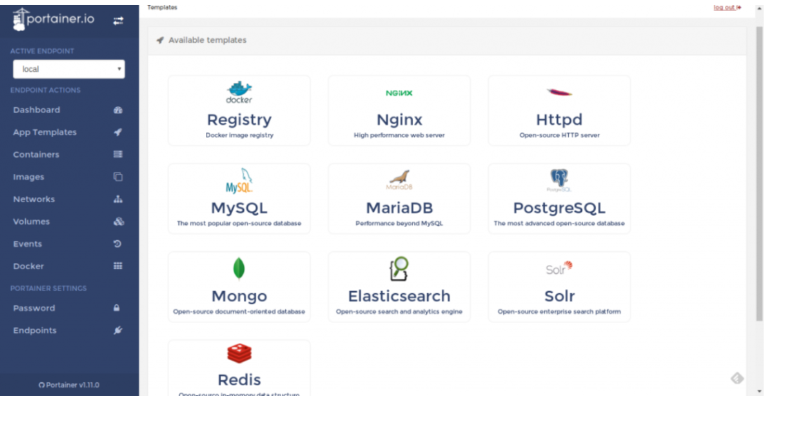
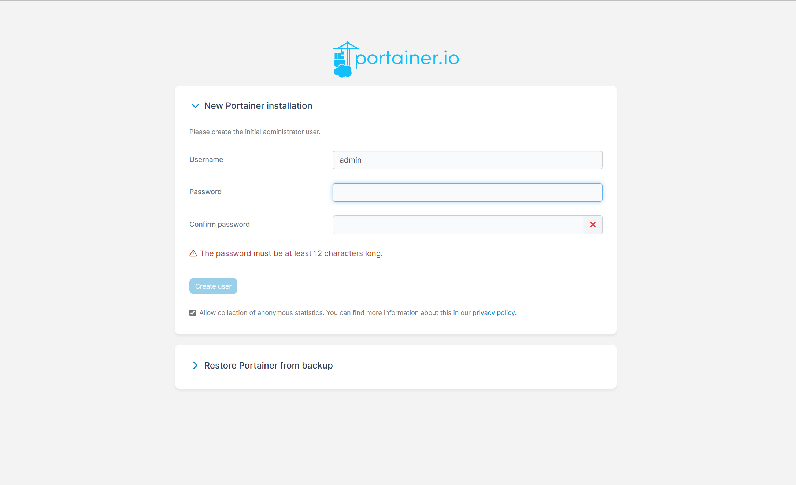
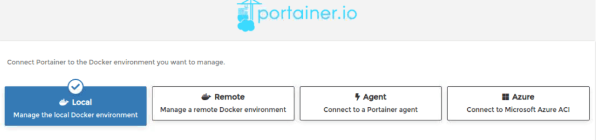

* ## How to install Portainer via Docker Compose:

### `Portainer`: is responsible for simplifying the maintenance and management of Docker’s containers. In other words, it helps us speed up deployments, allows monitoring, simplifies migration and also helps us solve problems quickly in an intuitive way. Furthermore, we have access to a web interface that makes the whole process simple and easy to pick up.



### `Step 1`: Install Docker Desktop for Windows:
### Before we can install Portainer, we need to have Docker installed on our Windows machine. You can download the latest version of Docker Desktop for Windows from the official Docker website. After that we need to run Docker app. 

### `Step 2`: Create a Docker Compose file:

### Create a new file called “docker-compose.yml” in a directory of your choice and paste the following code into it:
```bash
version: '3'

services:
  portainer:
    image: portainer/portainer
    ports:
      - 9000:9000
    volumes:
      - /var/run/docker.sock:/var/run/docker.sock
    restart: always
```

### `Step 3`: Start Portainer using Docker Compose:

### Open the git bash and navigate to the directory where the “docker-compose.yml” file is located. Then run the following command to start Portainer:

```bash
docker-compose up 
```
### `Step 4`: Access Portainer Web UI:

Once Portainer has started, you can access its web UI by navigating to `http://localhost:9000` in your web browser.

* ### Note: we nedd to create a new username and password.


- ### Finally, we will connect Portainer to the local Docker instance by choosing Local and Connect as seen here:



