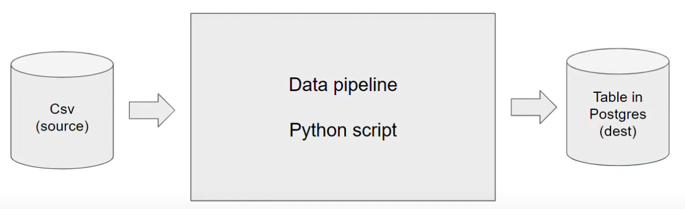
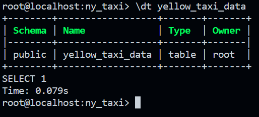
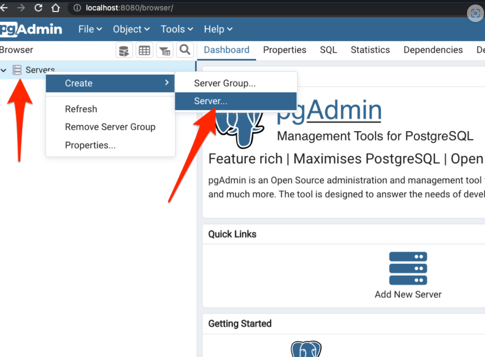
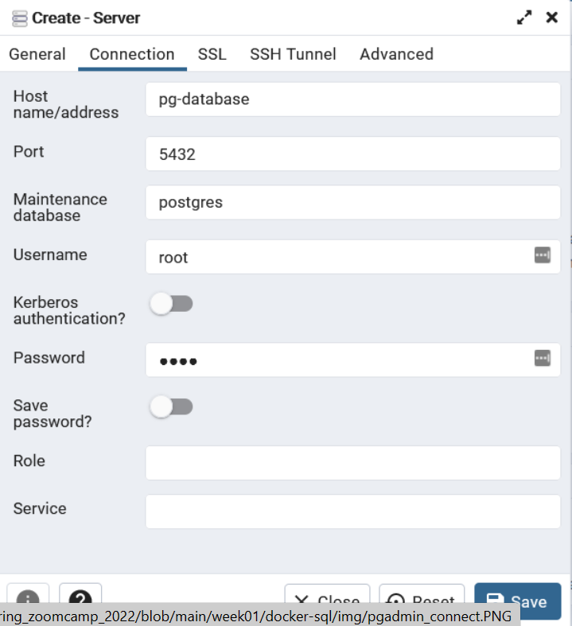
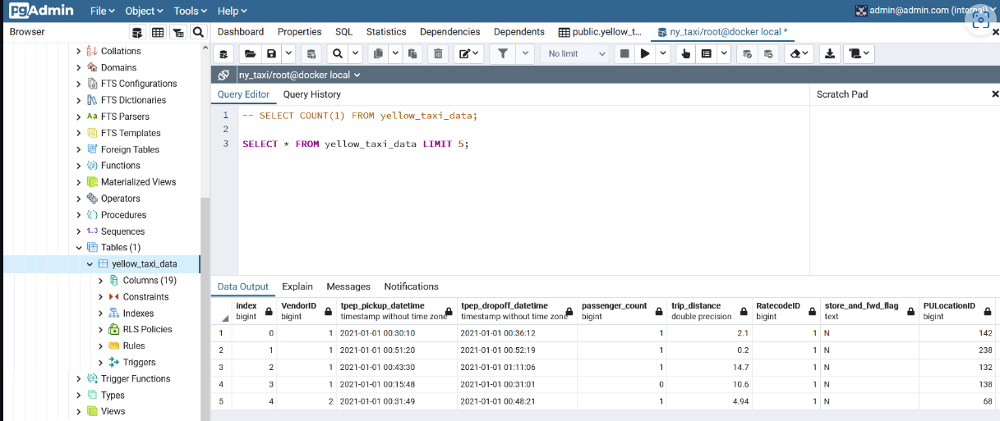

# Introduction to Data Engineering
***Data Engineering***: is the design and development of systems for collecting, storing and analyzing data at scale.

## Data pipelines

A **data pipeline** is a service that receives data as input and outputs more data. For example, reading a CSV file, transforming the data somehow and storing it as a table in a PostgreSQL database.



# Docker and Postgres
## Docker basic concepts

**Docker** is a _containerization software_ that allows us to isolate software in a similar way to virtual machines but in a much leaner way.

A **Docker image** is a _snapshot_ of a container that we can define to run our software, or in this case our data pipelines. By exporting our Docker images to Cloud providers such as Amazon Web Services or Google Cloud Platform we can run our containers there.

### 1. to run docker on bash:
#### `docker run -it --entrypoint=bash python:3.10`
### 2. to use python commands in docker:
#### `# python` 

## Creating a custom pipeline with Docker

Let's create an example pipeline. We will create a dummy `pipeline.py` Python script that receives an argument and prints it.

```python
import sys
import pandas # we don't need this but it's useful for the example

# print arguments
print(sys.argv)

# argument 0 is the name os the file
# argumment 1 contains the actual first argument we care about
day = sys.argv[1]

# cool pandas stuff goes here

# print a sentence with the argument
print(f'job finished successfully for day = {day}')
```

Let's containerize it by creating a Docker image. Create the folllowing `Dockerfile` file:

```dockerfile
# base Docker image that we will build on
FROM python:3.10

# set up our image by installing prerequisites; pandas in this case
RUN pip install pandas

# set up the working directory inside the container
WORKDIR /app
# copy the script to the container. 1st name is source file, 2nd is destination
COPY pipeline.py pipeline.py

# define what to do first when the container runs
# in this example, we will just run the script
ENTRYPOINT ["python", "pipeline.py"]
```


Let's build the image:


```ssh
docker build -t test:pandas .
```
* The image name will be `test` and its tag will be `pandas`. If the tag isn't specified it will default to `latest`.

We can now run the container and pass an argument to it, so that our pipeline will receive it:

```ssh
docker run -it test:pandas some_number
```

You should get the same output you did when you ran the pipeline script by itself.

>Note: these instructions asume that `pipeline.py` and `Dockerfile` are in the same directory. The Docker commands should also be run from the same directory as these files.


## Running Postgres in a container
### 1. we need to create yaml data and we write inside it  the following code: 

```bash
services:
  postgres:
    image: postgres:13
    environment:
      POSTGRES_USER: airflow
      POSTGRES_PASSWORD: airflow
      POSTGRES_DB: airflow
    volumes:
      - postgres-db-volume:/var/lib/postgresql/data
    healthcheck:
      test: ["CMD", "pg_isready", "-U", "airflow"]
      interval: 5s
      retries: 5
    restart: always


 
docker run -it \
  -e POSTGRES_USER="root" \ # environmental configurations
  -e POSTGRES_PASSWORD="root" \
  -e POSTGRES_DB="ny_taxi" \   # name of the database
  -v /workspaces/data-engineering/ny_taxi_postgres_data:/var/lib/postgresql/data \  # mount a volume: possibility to map a folder we have on the host machine to our container
  -p 5432:5432 \ # specify the port, map a port on our host machine to a port of the conatiner
  postgres:13
```

### 2. we need to create a folder to store the data in. We will use the example folder `ny_taxi_postgres_data`.

### 3. run the following command in bash: 
 ```bash
 docker run -it \
  -e POSTGRES_USER="root" \
  -e POSTGRES_PASSWORD="root" \
  -e POSTGRES_DB="ny_taxi" \
  -v /workspaces/data-engineering/basics_and_setup/docker_sql/ny_taxi_postgres_data:/var/lib/postgresql/data \
  -p 5432:5432 \
  postgres:13
```

* The container needs 3 environment variables:
    * `POSTGRES_USER` is the username for logging into the database. We chose `root`.
    * `POSTGRES_PASSWORD` is the password for the database. We chose `root`
        * ***IMPORTANT: These values are only meant for testing. Please change them for any serious project.***
    * `POSTGRES_DB` is the name that we will give the database. We chose `ny_taxi`.
* `-v` points to the volume directory. The colon `:` separates the first part (path to the folder in the host computer) from the second part (path to the folder inside the container).
    * Path names must be absolute. If you're in a UNIX-like system, you can use `pwd` to print you local folder as a shortcut; this example should work with both `bash` and `zsh` shells, but `fish` will require you to remove the `$`.
    * This command will only work if you run it from a directory which contains the `ny_taxi_postgres_data` subdirectory you created above.
* The `-p` is for port mapping. We map the default Postgres port to the same port in the host.
* The last argument is the image name and tag. We run the official `postgres` image on its version `13`.


- the command `docker ps` used to check if server is running.

Once the container is running, we can log into our database with [pgcli](https://www.pgcli.com/) with the following command:

```bash
pgcli -h localhost -p 5432 -u root -d ny_taxi
```
* `-h` is the host. Since we're running locally we can use `localhost`.
* `-p` is the port.
* `-u` is the username.
* `-d` is the database name.
* The password is not provided; it will be requested after running the command.

- `pgcli`: python lib.

## Ingesting data to Postgres with Python
1. I will now create a Jupyter Notebook `upload-data.ipynb` file which we will use to read a CSV file and export it to Postgres.

2. download the NYC taxi dataset.
```
wget https://d37ci6vzurychx.cloudfront.net/trip-data/yellow_tripdata_2021-01.parquet
```

3. convert dataset file into csv if required

4. ingest the data to Postgres using Jupyter Notebook. ee [upload-data.ipynb](./docker_sql/upload_data.ipynb).  Afterwards, we can check the ingested data using ```\dt``` in Postgres' terminal to list the tables, and ```\d yellow_taxi_data``` to describe the table ```yellow_taxi_data```.


5. I can now use ```pgcli -h localhost -p 5432 -u root -d ny_taxi``` on a separate terminal to look at the database:

- `\dt` for looking at available tables.
- `\d yellow_taxi_data` for describing the new table.

* i will get this result in terminal:




## Connecting pgAdmin and Postgres with Docker networking

`pgcli` is a handy tool but it's cumbersome to use. [`pgAdmin` is a web-based tool](https://www.pgadmin.org/download/pgadmin-4-container/) that makes it more convenient to access and manage our databases. It's possible to run pgAdmin as as container along with the Postgres container, but both containers will have to be in the same _virtual network_ so that they can find each other.


####  How to running pgAdmin:
##### in `docker-compose.yaml` we copy th following command:
```bash
  docker run -it \
  -e PGADMIN_DEFAULT_EMAIL="admin@admin.com" \
  -e PGADMIN_DEFAULT_PASSWORD="root" \
  -p 8080:80 \
  dpage/pgadmin4
```
##### then paste it in terminal. 

## Docker Networks
### We need to use a Docker network so that one container that is running pgAdmin can communicate with another container that has the database (with a mounted volume).

### 1. Create a network:
```bash 
docker network create pg-network
```
* You can remove the network later with the command `docker network rm pg-network` . You can look at the existing networks with `docker network ls` .

### 2. Now when we run the docker containers postgres, we need to add an argument to tell them to connect to the network we created.

```bash
 docker run -it \
  -e POSTGRES_USER="root" \
  -e POSTGRES_PASSWORD="root" \
  -e POSTGRES_DB="ny_taxi" \
  -v /workspaces/data-engineering/basics_and_setup/docker_sql/ny_taxi_postgres_data:/var/lib/postgresql/data \
  -p 5432:5432 \
  --network=pg-network \
  --name=pg-database \
  postgres:13
```
### 3. We will now run the pgAdmin container on another terminal:
```bash
docker run -it \
    -e PGADMIN_DEFAULT_EMAIL="admin@admin.com" \
    -e PGADMIN_DEFAULT_PASSWORD="root" \
    -p 8080:80 \
    --network=pg-network \
    --name pgadmin \
    dpage/pgadmin4
```

### * NOTE: to stop docker running server using this command in terminal: 

```bash
docker stop container_id
```
#### we can get container_id and check which server is running using:
```bash
docker ps -a
```
#### to remove it forcefully:
```bash 
docker rm -f container_id
```

### 3. I should now be able to load pgAdmin on a web browser by browsing to localhost:8080. Use the same email and password you used for running the container to log in.
###  4. Right-click on Servers on the left sidebar and select Create > Server


### 5. Now i connect to the server, I use the name of the Postgres container as the hostname/address which in our case was pg-database.



### Now we have a fully featured graphical SQL manager that we can use to run admin tasks on the database and run queries using the Query Tool.

